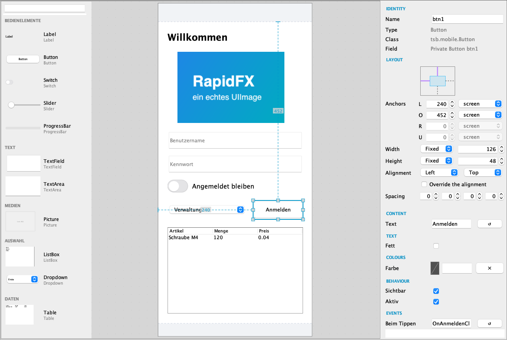
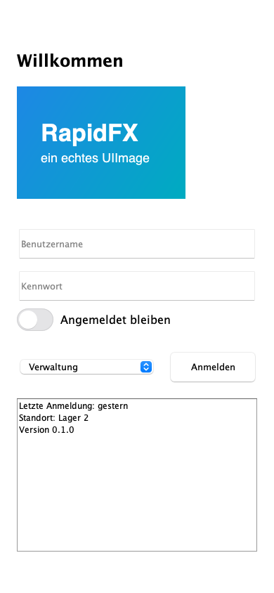
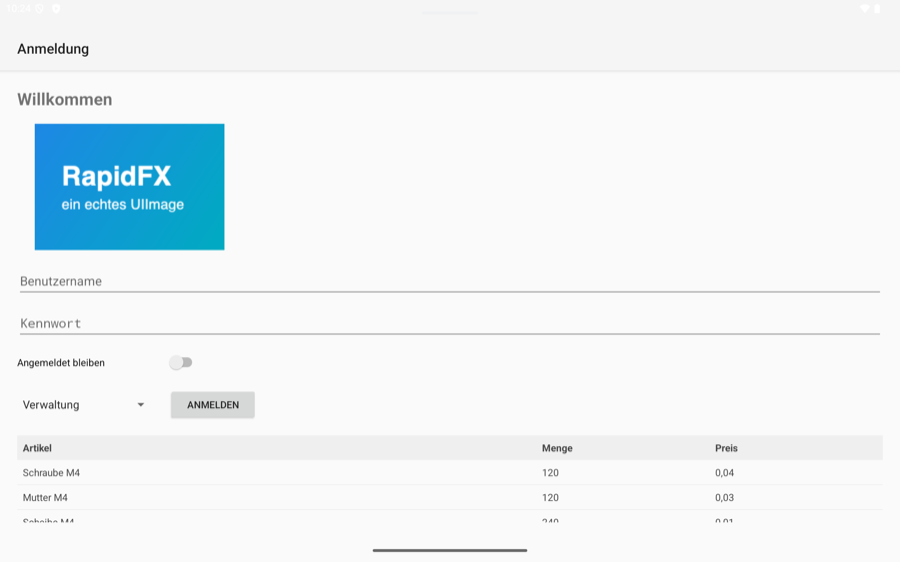
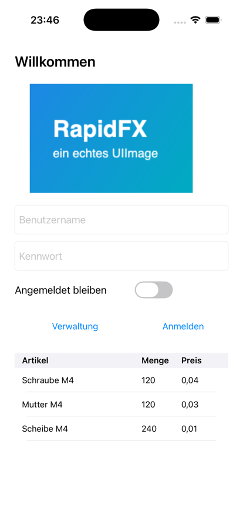
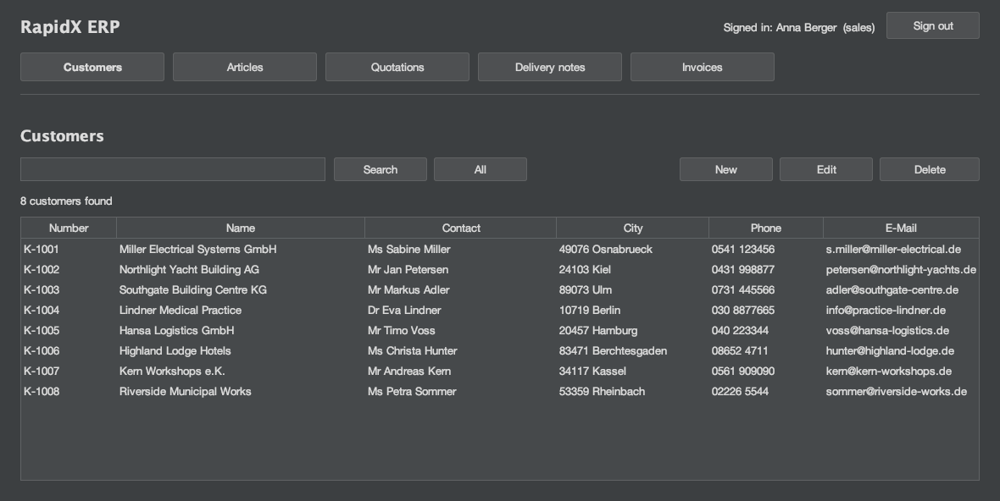
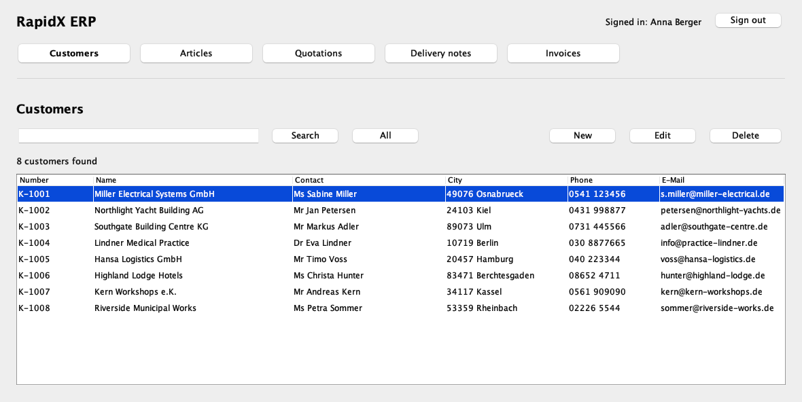

# tsbRapidFX — the IDE plugin

**One plugin for IntelliJ IDEA.** It carries the tsbRapidFX compiler, the form designers for the
**desktop, the web and mobile**, and **tsbDeploy**, which turns a finished program into a native
installer. Desktop, web, Android, iOS and packaging — from the same `.rfx` files, in one IDE.

> **Downloads are under [Releases](../../releases).** This repository holds the documentation and
> the issue tracker; the plugin itself is published as a release file.

---

## The designer

A palette on the left, the form in the middle, everything about the selected component on the
right. What it writes is a plain `.rfx` source file — readable text, not a binary layout format —
and what it reads back is the same file, even after you have edited it by hand.

That round trip is checked on every build: each form is parsed, written out again, and compared
byte for byte. A designer that quietly reformats your source is a designer you stop trusting.

## One form, four places

The same form file, opened by the designer once, running on the desktop, on Android and on iOS:

| Desktop | Android | iOS |
|---|---|---|
|  |  |  |

Nothing is regenerated between them. The components are the same objects; only the backend that
draws them changes — and the same is true of a Swing form mirrored into a browser as SVG.

---

## What is in it

### Desktop & web

The language in the IDE — syntax, completion, errors while you type, go to definition, structure
view — and the **Swing designer** for desktop applications and for web applications, which are the
same Swing forms mirrored into a browser.

The same application in a browser, drawn as SVG from the same forms:

### Mobile

The **mobile designer** and the toolchain that goes with it: **New RapidFX Project… ▸ Mobile app**
(phone, tablet or large phone, portrait or landscape), then one **Run** button that builds and
launches on the desktop simulator, on Android or on iOS. Android draws through `android.widget` and
ConstraintLayout, iOS through UIKit; the `renderer = swing` route draws either through the ported
`java.desktop`. Android needs the Android SDK but **not Android Studio** — **Tools ▸ Set Up Android
SDK…** installs it. iOS builds on a Mac. Release builds sign an APK or an IPA.

### tsbDeploy — native installers

**Package with tsbDeploy…** turns a desktop or web program into an installer with its own Java
runtime inside: `.exe`/`.msi` for Windows, `.dmg`/`.pkg` for macOS, AppImage for Linux — each for
x86_64 and aarch64, built **from any one of those hosts** (the `.pkg` on a Mac only). tsbDeploy is
also sold as a **standalone plugin** for packaging programs not written in RapidFX; that one and
this combined plugin are marked incompatible, so only one is ever installed. Whoever has RapidFX has
tsbDeploy already.

---

## Installing

1. Download the `.zip` from [Releases](../../releases).
2. In IntelliJ IDEA: **Settings ▸ Plugins ▸ ⚙ ▸ Install Plugin from Disk…**
3. Choose the zip, then restart the IDE.

Needs **IntelliJ IDEA 2025.2** or newer, and a **JDK 21** or newer. Community Edition is enough.

---

## Documentation

The complete manual is in [`docs/tsbRapidFX-Manual.md`](docs/tsbRapidFX-Manual.md) — the language,
the Java class library, databases, Swing on the desktop and in the browser, web applications, the
three designers, and packaging with tsbDeploy. There is an RTF beside it,
[`docs/tsbRapidFX-Manual.rtf`](docs/tsbRapidFX-Manual.rtf), for Word, Pages or LibreOffice.

Every program in the manual was compiled by the real `rfxc` before it was printed, and the ones
that produce output were run.

---

## Thirty days, and then

The designer runs for **thirty days** from the first form you open. After that the designer asks to
be bought — and only the designer.

**Everything else carries on for ever:** the editor, the completion, the error marks, the structure
view, and compiling from the IDE. The compiler and the runtime are
[Apache 2.0](https://github.com/thorstenstueker/tsbRapidFX) and always will be. Your forms are
untouched either way — they are ordinary `.rfx` source files and can be opened, read and edited as
text by anything.

You are reminded at fourteen days, seven, three, two and one. Nobody should meet this without
warning.

> **This is a work-in-progress preview — the `2026.1.x` series.** It is being fixed and rebuilt
> often, and while it is `2026.1.x`, updating to a newer build restarts the thirty days, because a
> new build is where the next round of fixes lands. That renewal is for this preview series only.

### Unlocking after purchase

No licence server, no account, no phoning home.

1. The designer shows a **station code** — twenty characters identifying that installation.
2. Send it with the address you bought under.
3. You get a **licence block** back by e-mail.
4. Paste it into **I have a licence…** in the designer.

That is once, for that machine, for the version scope the licence names — through reinstalling the
plugin, updating the IDE and updating the plugin within that scope. A second machine has a second
station code and needs its own licence. The check is a signature the plugin verifies against a
public key compiled into it, offline. It never contacts anything.

---

## Something not working?

[Open an issue](../../issues). Useful to include:

* the plugin version — **Settings ▸ Plugins** shows it
* IntelliJ IDEA's version, from **Help ▸ About**
* what you did and what happened instead

If the compiler reported something, paste the message: it names the file, the line and the column,
and that is usually enough to find it straight away.

Questions about the **language itself** — the compiler, the runtime, `rfxc` — belong in
[thorstenstueker/tsbRapidFX](https://github.com/thorstenstueker/tsbRapidFX/issues), which is where
that code lives.

---

## Licence

The plugin is **commercial software** under the **TSB Commercial License (TSB-CL) 1.5**.
Copyright © 2026 tsb Thorsten Stueker Buero for Technology development. See `LICENSE` — including
what applications built with it may contain and ship (the tsb.mobile backends, tsbWEB, tsbswing).
Questions: licensequestions@stueker.org

The compiler, the runtime and the tsb.mobile API it carries are Apache 2.0 and are published
separately at [thorstenstueker/tsbRapidFX](https://github.com/thorstenstueker/tsbRapidFX). That
split is deliberate: whatever happens to this company, an application written with tsbRapidFX can
still be rebuilt — without the designer, without automation, but without asking anybody's
permission.

## Legal

This repository content is courtesy of. For legal requests or complaints:

Impressum

Thorsten Stüker – Barntrup
Stüker UG
verantwortlich für den Inhalt / responsible for the content: Thorsten Stüker
Registration: Handelsregister am AG Lemgo, HRB 8858

UST-ID / VAT ID: DE318562361

Adresse / Adress
Hamelner Straße 1
32683 Barntrup
Germany

Phone +(49) 05263-4001590

mail legal@stueker.org
web stueker@stueker.org

mail ug@stueker.org
web stueker@stueker.org

Öffnungszeiten / Office-hours
Mon. - Fr.: 10am – 4pm 
responsible for the content:

Thorsten Stüker, Hamelner Str. 1, 32683 Barntrup, Germany
